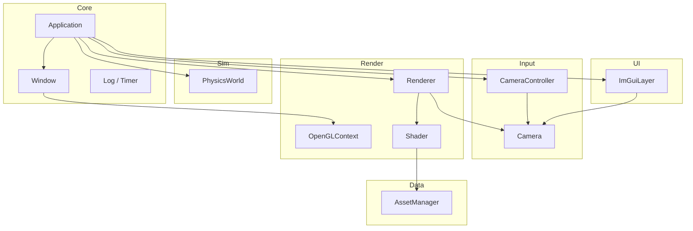

# Architecture Overview

This document describes the scalable architecture for the Black Hole Simulator. The foundation prioritizes **separation of concerns** so physics, rendering, and UI can evolve independently.

## Design principles

1. **Module boundaries** — Each folder under `src/` is a logical module with a narrow public API.
2. **Singleton coordinators** — `Renderer`, `PhysicsWorld`, `CameraController`, and `ImGuiLayer` expose `instance()` for now; these can become injectable services later if testing demands it.
3. **No physics in rendering** — The renderer consumes camera matrices only; metric tensors and geodesics live in Physics.
4. **Assets are data** — Shaders, textures, and meshes load through `AssetManager`, never hard-coded in render code.
5. **Fail fast** — Initialization and IO errors throw via `Log::fatal()` with descriptive messages.

## Layer diagram



## Module roadmap

| Module | Foundation (now) | Future |
|--------|------------------|--------|
| **Core** | Main loop, GLFW window | Config files, command-line args |
| **Rendering** | Clear + reference cube | Starfield, disk, lensing shader, post-processing |
| **Camera** | FPS controls | Orbital camera, focus on singularity |
| **Physics** | Empty stub | Schwarzschild metric, geodesic integrator, particle orbits |
| **UI** | Debug panel | Parameter sliders (mass, spin, disk density) |
| **Assets** | Text file loading | glTF meshes, HDR environments |

## Planned feature placement

| Feature | Target module |
|---------|---------------|
| Event horizon | Physics (radius) + Rendering (sphere/mesh) — done |
| Schwarzschild radius | Physics constants (done) + UI display (pending) |
| Photon sphere | Physics + Rendering (wireframe sphere) |
| Accretion disk | Rendering (custom shader) + Physics (thermodynamics) |
| Particle orbits | Physics (integrator) + Rendering (instanced points) |
| Gravitational lensing | Rendering (ray march / texture distortion) |
| Relativistic effects | Physics (Doppler, redshift) + Rendering |
| Starfield | Rendering (skybox or procedural points) |

## Frame loop

```
poll events → update camera → update physics → ImGui begin
→ render scene → ImGui render → swap buffers
```

## Dependency graph (third-party)

- **GLFW** — Window and input
- **GLAD** — OpenGL function loading
- **GLM** — Math (matrices, vectors)
- **Dear ImGui** — Debug overlay

All fetched at configure time via `cmake/Dependencies.cmake` (FetchContent).
