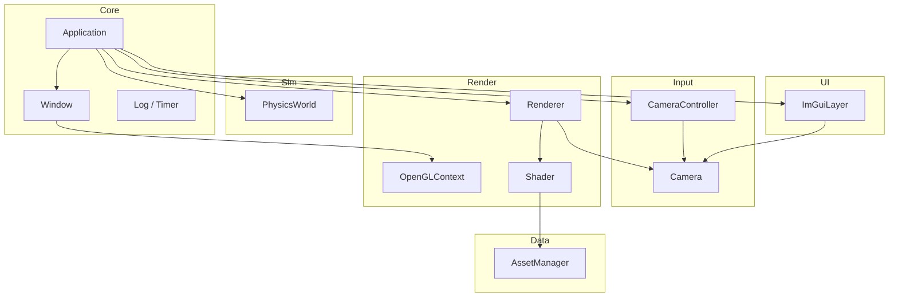

# Architecture Overview

This document describes the scalable architecture for the Black Hole Simulator. The foundation prioritizes **separation of concerns** so physics, rendering, and UI can evolve independently.

## Design principles

1. **Module boundaries** — Each folder under `src/` is a logical module with a narrow public API.
2. **Singleton coordinators** — `Renderer`, `PhysicsWorld`, `CameraController`, and `ImGuiLayer` expose `instance()` for now; these can become injectable services later if testing demands it.
3. **No physics in rendering** — The renderer consumes camera matrices only; metric tensors and geodesics live in Physics.
4. **Assets are data** — Shaders, textures, and meshes load through `AssetManager`, never hard-coded in render code.
5. **Fail fast** — Initialization and IO errors throw via `Log::fatal()` with descriptive messages.

## Layer diagram


```mermaid
flowchart TB
    subgraph Core
        App[Application]
        Win[Window]
        Log[Log / Timer]
    end

    subgraph Input
        CamCtrl[CameraController]
        Cam[Camera]
    end

    subgraph Render
        GLCtx[OpenGLContext]
        Rnd[Renderer]
        Shd[Shader]
    end

    subgraph Sim
        Phys[PhysicsWorld]
    end

    subgraph UI
        ImGui[ImGuiLayer]
    end

    subgraph Data
        Assets[AssetManager]
    end

    App --> Win
    App --> CamCtrl
    App --> Rnd
    App --> Phys
    App --> ImGui
    CamCtrl --> Cam
    Rnd --> Shd
    Rnd --> Cam
    Shd --> Assets
    Win --> GLCtx
    ImGui --> Cam
```

## Module roadmap

| Module | Foundation (now) | Future |
|--------|------------------|--------|
| **Core** | Main loop, GLFW window | Config files, command-line args |
| **Rendering** | Clear + reference cube | Starfield, disk, lensing shader, post-processing |
| **Camera** | FPS controls | Orbital camera, focus on singularity |
| **Physics** | Empty stub | Schwarzschild metric, geodesic integrator, particle orbits |
| **UI** | Debug panel | Parameter sliders (mass, spin, disk density) |
| **Assets** | Text file loading | glTF meshes, HDR environments |

## Planned feature placement

| Feature | Target module |
|---------|---------------|
| Event horizon | Physics (radius) + Rendering (sphere/mesh) — implemented (v0.3) |
| Schwarzschild radius | Physics constants + UI display — implemented (v0.3 radius, v0.4 UI display) |
| Photon sphere | Physics + Rendering (wireframe sphere) — implemented (v0.4) |
| Accretion disk | Rendering (custom shader) + Physics (thermodynamics) |
| Particle orbits | Physics (integrator) + Rendering (instanced points) |
| Gravitational lensing | Rendering (fullscreen pass, per-pixel Schwarzschild geodesic integration) + Physics (mass/Rs) — implemented (v0.5) |
| Relativistic effects | Physics (Doppler, redshift) + Rendering |
| Starfield | Rendering (skybox or procedural points) |

## Frame loop

```
poll events → update camera → update physics → ImGui begin
→ render scene → ImGui render → swap buffers
```

## Milestone 5: Gravitational lensing

Implemented as a fullscreen fragment-shader pass (`assets/shaders/lensing.vert`
/ `lensing.frag`), toggled at runtime via `Renderer::setLensingEnabled()`.
When enabled it fully replaces the M1-M4 scene for that frame; when disabled,
M1-M4 render exactly as before. It reuses the Phase 2 baked starfield
cubemap (`EnvironmentBaker`) as the "sky at infinity" and reads mass/Rs from
the existing `PhysicsWorld` accessors — no changes to `PhysicsWorld`,
`Camera`, or `Mesh` were needed.

### Pipeline (per pixel)

1. Reconstruct the world-space ray direction `D` from `vScreenUV` via
   `uInvProjection`/`uInvView` (unchanged from Phase 3).
2. With the black hole at the world origin and camera at `C = uCameraPos`:
   `r0 = |C|`, `rhat = normalize(C)`.
3. `n = normalize(cross(rhat, D))` defines the ray's orbital plane;
   `e_r = rhat`, `e_phi = cross(n, e_r)`. If `dot(D, e_phi) < 0`, flip `n`
   and `e_phi` so phi increases in the ray's direction of travel (angular
   momentum, and hence its sign, is conserved along the whole geodesic, so
   this only needs deciding once).
4. `D_r = dot(D, e_r)`, `D_phi = dot(D, e_phi)`. Since `D`, `e_r`, `e_phi`
   are an orthonormal in-plane basis and `D` has no `n`-component,
   `D_r^2 + D_phi^2 = 1` exactly.
5. Impact parameter: `b = r0 * D_phi / sqrt(f(r0))`, `f(r) = 1 - Rs/r`.
6. Initial `du/dphi = -sign(D_r) * sqrt(1/b^2 - u0^2*f(r0))`, `u0 = 1/r0`.
7. Integrate `du/dphi = v`, `dv/dphi = 3*M*u^2 - u` forward in `phi` with
   fixed-step RK4 until capture, escape, or the winding cutoff (see
   "Named constants" below).
8. On escape, reconstruct the asymptotic direction
   `D_final = cos(phi)*e_r + sin(phi)*e_phi` and sample `uEnvironment`.
   On capture, output black (the shadow).

Rays whose orbital-plane normal would be numerically unstable to construct
(`|cross(rhat, D)|` below `kNearRadialThreshold`, i.e. `D` almost exactly
radial) skip the ODE entirely: an exactly radial null geodesic isn't
deflected in direction by a spherically symmetric spacetime, so the case
reduces to "does it reach `Rs`" (capture if inward and `Rs > 0`) or "escapes
along the original `D`" (outward, or no black hole present).

### Self-consistency of the initial-condition formula

Substituting `D_phi = sqrt(1 - D_r^2)` (from step 4) into the `b` formula
(step 5) and then into the `du/dphi` formula (step 6) simplifies exactly to
`du/dphi|0 = -u0*sqrt(f0)*D_r/D_phi`, which is also what falls out directly
from `u = 1/r` and the chain rule along the ray's initial 3D direction. This
confirms the two given formulas are not independent inputs but algebraically
consistent, and it shows the tangential case (`D_r = 0`) naturally gives
`du/dphi|0 = 0` without needing to special-case it.

### Named constants (all in `lensing.frag`)

| Constant | Value | Purpose |
|---|---|---|
| `kPhiStep` | 0.02 rad | Fixed RK4 step in `phi`. |
| `kMaxPhiSteps` | 3000 | Hard iteration cap — guarantees termination. `kMaxPhiSteps * kPhiStep` = 60 rad (~9.5 windings) of maximum travel before the winding cutoff resolves a ray as captured. |
| `kNearRadialThreshold` | 1e-4 | `\|cross(rhat, D)\|` below which the closed-form radial case is used instead of the ODE. |
| `kEscapeRadius` | 2000.0 | `r` beyond which a ray is considered to have reached "infinity" and the cubemap is sampled. |
| `kNoHorizonInvRs` | 3.402823e38 | Stand-in for `1/Rs` when `Rs <= 0`, avoiding a literal `1.0/0.0` in GLSL. |

### Numerical validation

Performed by replicating the exact integrator (same formulas, same named
constants) in Python (`/home/claude/validate/validate.py` in the working
environment used to build this milestone; not part of the shipped repo).
This is analytic/numerical validation of the algorithm, **not** a GPU/visual
run of the actual application — see "Runtime validation" in the final
report for what could and couldn't be executed in this environment.

- **M=0 (flat space)**: `u'' + u = 0` reduces to Euclidean straight lines.
  All 5 required cases (radial in/out, tangential, generic in/out) reproduce
  the original direction: exactly (`err = 0`) for the two radial cases, and
  to within RK4 discretization/finite-escape-radius tolerance for the
  angled cases — `~9e-3` to `~1.8e-2` at production constants
  (`kPhiStep=0.02`, `kEscapeRadius=2000`), shrinking to `~2e-4`–`~5e-4` when
  step size and escape radius are refined by ~40x/5000x, confirming the
  residual is discretization error, not a formula bug. One real bug was
  caught and fixed by this test: the near-radial closed-form branch must
  only capture an inward ray when `Rs > 0` — an `M=0` "black hole" has no
  horizon and cannot capture anything, matching the guard now in the code
  (`Dr < 0.0 && Rs > 0.0`).
- **b_crit / Rp**: `Rp = 3M`, and `3*sqrt(3)*M` matches
  `Rp/sqrt(f(Rp))` to floating-point precision.
- **Capture/escape boundary**: with `M=1`, `Rs=2`, camera at `r0=10`
  (representative of typical play distances) and production constants,
  exact-`b` targeting shows capture for `b/b_crit` up to `1.00000` and
  escape from `1.00001` — i.e. the boundary resolves to 5 decimal places.
  Winding (`phi` traveled) increases monotonically as `b -> b_crit` from
  both sides (3.08 -> 22.94 rad approaching from below; 13.72 -> 4.62 rad
  receding above), matching the expected near-critical behavior.
- **Weak-field deflection**: for `M=1`, `r0=500`, launched rays with exact
  impact parameters `b = 50..400` (large compared to `Rs=2`) give measured
  deflection converging to the predicted `4M/b` as `b` grows (ratio
  0.97-1.18 across that range, tightening toward 1.0 at the largest `b`
  tested), consistent with `4M/b` being the leading-order term of a series
  that isn't exact at moderate `b`.

## Dependency graph (third-party)

- **GLFW** — Window and input
- **GLAD** — OpenGL function loading
- **GLM** — Math (matrices, vectors)
- **Dear ImGui** — Debug overlay

All fetched at configure time via `cmake/Dependencies.cmake` (FetchContent).
