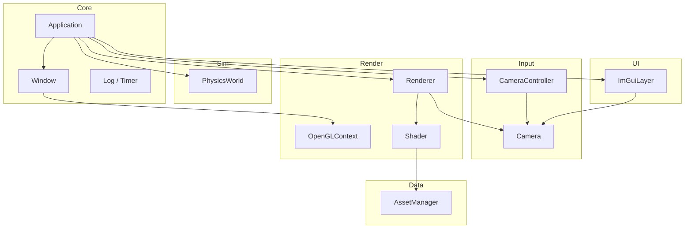

# Architecture Overview

This document describes the scalable architecture for the Black Hole Simulator. The foundation prioritizes **separation of concerns** so physics, rendering, and UI can evolve independently.

## Design principles

1. **Module boundaries** — Each folder under `src/` is a logical module with a narrow public API.
2. **Singleton coordinators** — `Renderer`, `PhysicsWorld`, `CameraController`, and `ImGuiLayer` expose `instance()` for now; these can become injectable services later if testing demands it.
3. **No physics in rendering** — The renderer consumes camera matrices only; metric tensors and geodesics live in Physics.
4. **Assets are data** — Shaders, textures, and meshes load through `AssetManager`, never hard-coded in render code.
5. **Fail fast** — Initialization and IO errors throw via `Log::fatal()` with descriptive messages.

## Layer diagram


```mermaid
flowchart TB
    subgraph Core
        App[Application]
        Win[Window]
        Log[Log / Timer]
    end

    subgraph Input
        CamCtrl[CameraController]
        Cam[Camera]
    end

    subgraph Render
        GLCtx[OpenGLContext]
        Rnd[Renderer]
        Shd[Shader]
    end

    subgraph Sim
        Phys[PhysicsWorld]
    end

    subgraph UI
        ImGui[ImGuiLayer]
    end

    subgraph Data
        Assets[AssetManager]
    end

    App --> Win
    App --> CamCtrl
    App --> Rnd
    App --> Phys
    App --> ImGui
    CamCtrl --> Cam
    Rnd --> Shd
    Rnd --> Cam
    Shd --> Assets
    Win --> GLCtx
    ImGui --> Cam
```

## Module roadmap

| Module | Foundation (now) | Future |
|--------|------------------|--------|
| **Core** | Main loop, GLFW window | Config files, command-line args |
| **Rendering** | Clear + reference cube | Starfield, disk, lensing shader, post-processing |
| **Camera** | FPS controls | Orbital camera, focus on singularity |
| **Physics** | Empty stub | Schwarzschild metric, geodesic integrator, particle orbits |
| **UI** | Debug panel | Parameter sliders (mass, spin, disk density) |
| **Assets** | Text file loading | glTF meshes, HDR environments |

## Planned feature placement

| Feature | Target module |
|---------|---------------|
| Event horizon | Physics (radius) + Rendering (sphere/mesh) — implemented (v0.3) |
| Schwarzschild radius | Physics constants + UI display — implemented (v0.3 radius, v0.4 UI display) |
| Photon sphere | Physics + Rendering (wireframe sphere) — implemented (v0.4) |
| Accretion disk | Rendering (custom shader) + Physics (thermodynamics) |
| Particle orbits | Physics (integrator) + Rendering (instanced points) |
| Gravitational lensing | Rendering (fullscreen pass, per-pixel Schwarzschild geodesic integration) + Physics (mass/Rs) — implemented (v0.5) |
| Relativistic effects | Physics (Doppler, redshift) + Rendering |
| Starfield | Rendering (skybox or procedural points) |

## Frame loop

```
poll events → update camera → update physics → ImGui begin
→ render scene → ImGui render → swap buffers
```

## Input routing (ImGui / Camera)

The layer diagram above draws `ImGui --> Cam`: ImGui is meant to gate
whether a click/scroll/key goes to the camera or to a debug-panel widget.
`ImGuiLayer::initialize()` calls `ImGui_ImplGlfw_InitForOpenGL(window,
false)` (`install_callbacks=false`) specifically so `CameraController` can
make that per-event decision — but until this fix, `CameraController`'s
`glfwSet*Callback` registrations (the only ones ever installed on the
window) never forwarded anything to ImGui at all, so no ImGui widget could
ever be clicked, and `ImGuiConfigFlags_NavEnableKeyboard` (set in
`ImGuiLayer::initialize()`) was inert. Fixed in `CameraController.cpp`:
every mouse/scroll/key/char callback now forwards the raw event to the
matching `ImGui_ImplGlfw_*Callback` first, then checks
`ImGui::GetIO().WantCaptureMouse` before applying a click/drag/scroll to
the camera. `processKeyboard()` (WASD) checks `WantTextInput` specifically
rather than the broader `WantCaptureKeyboard` — `WantCaptureKeyboard` is
persistently true whenever `NavEnableKeyboard` is set and any ImGui window
has nav focus (true almost all the time with a single always-visible
Debug window), which blocked WASD entirely in an earlier version of this
fix; `WantTextInput` is only true while an ImGui text field is actively
being edited (e.g. after Ctrl+click on a slider), which is the actual
condition WASD needs to yield to. This is a routing fix to existing
(pre-M6) plumbing, not new milestone functionality.

## Milestone 5: Gravitational lensing

Implemented as a fullscreen fragment-shader pass (`assets/shaders/lensing.vert`
/ `lensing.frag`), toggled at runtime via `Renderer::setLensingEnabled()`.
When enabled it fully replaces the M1-M4 scene for that frame; when disabled,
M1-M4 render exactly as before. It reuses the Phase 2 baked starfield
cubemap (`EnvironmentBaker`) as the "sky at infinity" and reads mass/Rs from
the existing `PhysicsWorld` accessors — no changes to `PhysicsWorld`,
`Camera`, or `Mesh` were needed.

### Pipeline (per pixel)

1. Reconstruct the world-space ray direction `D` from `vScreenUV` via
   `uInvProjection`/`uInvView` (unchanged from Phase 3).
2. With the black hole at the world origin and camera at `C = uCameraPos`:
   `r0 = |C|`, `rhat = normalize(C)`.
3. `n = normalize(cross(rhat, D))` defines the ray's orbital plane;
   `e_r = rhat`, `e_phi = cross(n, e_r)`. If `dot(D, e_phi) < 0`, flip `n`
   and `e_phi` so phi increases in the ray's direction of travel (angular
   momentum, and hence its sign, is conserved along the whole geodesic, so
   this only needs deciding once).
4. `D_r = dot(D, e_r)`, `D_phi = dot(D, e_phi)`. Since `D`, `e_r`, `e_phi`
   are an orthonormal in-plane basis and `D` has no `n`-component,
   `D_r^2 + D_phi^2 = 1` exactly.
5. Impact parameter: `b = r0 * D_phi / sqrt(f(r0))`, `f(r) = 1 - Rs/r`.
6. Initial `du/dphi = -sign(D_r) * sqrt(1/b^2 - u0^2*f(r0))`, `u0 = 1/r0`.
7. Integrate `du/dphi = v`, `dv/dphi = 3*M*u^2 - u` forward in `phi` with
   fixed-step RK4 until capture, escape, or the winding cutoff (see
   "Named constants" below).
8. On escape, reconstruct the asymptotic direction
   `D_final = cos(phi)*e_r + sin(phi)*e_phi` and sample `uEnvironment`.
   On capture, output black (the shadow).

Rays whose orbital-plane normal would be numerically unstable to construct
(`|cross(rhat, D)|` below `kNearRadialThreshold`, i.e. `D` almost exactly
radial) skip the ODE entirely: an exactly radial null geodesic isn't
deflected in direction by a spherically symmetric spacetime, so the case
reduces to "does it reach `Rs`" (capture if inward and `Rs > 0`) or "escapes
along the original `D`" (outward, or no black hole present).

### Self-consistency of the initial-condition formula

Substituting `D_phi = sqrt(1 - D_r^2)` (from step 4) into the `b` formula
(step 5) and then into the `du/dphi` formula (step 6) simplifies exactly to
`du/dphi|0 = -u0*sqrt(f0)*D_r/D_phi`, which is also what falls out directly
from `u = 1/r` and the chain rule along the ray's initial 3D direction. This
confirms the two given formulas are not independent inputs but algebraically
consistent, and it shows the tangential case (`D_r = 0`) naturally gives
`du/dphi|0 = 0` without needing to special-case it.

### Named constants (all in `lensing.frag`)

| Constant | Value | Purpose |
|---|---|---|
| `kPhiStep` | 0.02 rad | Fixed RK4 step in `phi`. |
| `kMaxPhiSteps` | 3000 | Hard iteration cap — guarantees termination. `kMaxPhiSteps * kPhiStep` = 60 rad (~9.5 windings) of maximum travel before the winding cutoff resolves a ray as captured. |
| `kNearRadialThreshold` | 1e-4 | `\|cross(rhat, D)\|` below which the closed-form radial case is used instead of the ODE. |
| `kEscapeRadius` | 2000.0 | `r` beyond which a ray is considered to have reached "infinity" and the cubemap is sampled. |
| `kNoHorizonInvRs` | 3.402823e38 | Stand-in for `1/Rs` when `Rs <= 0`, avoiding a literal `1.0/0.0` in GLSL. |

### Numerical validation

Performed by replicating the exact integrator (same formulas, same named
constants) in Python (`/home/claude/validate/validate.py` in the working
environment used to build this milestone; not part of the shipped repo).
This is analytic/numerical validation of the algorithm, **not** a GPU/visual
run of the actual application — see "Runtime validation" in the final
report for what could and couldn't be executed in this environment.

- **M=0 (flat space)**: `u'' + u = 0` reduces to Euclidean straight lines.
  All 5 required cases (radial in/out, tangential, generic in/out) reproduce
  the original direction: exactly (`err = 0`) for the two radial cases, and
  to within RK4 discretization/finite-escape-radius tolerance for the
  angled cases — `~9e-3` to `~1.8e-2` at production constants
  (`kPhiStep=0.02`, `kEscapeRadius=2000`), shrinking to `~2e-4`–`~5e-4` when
  step size and escape radius are refined by ~40x/5000x, confirming the
  residual is discretization error, not a formula bug. One real bug was
  caught and fixed by this test: the near-radial closed-form branch must
  only capture an inward ray when `Rs > 0` — an `M=0` "black hole" has no
  horizon and cannot capture anything, matching the guard now in the code
  (`Dr < 0.0 && Rs > 0.0`).
- **b_crit / Rp**: `Rp = 3M`, and `3*sqrt(3)*M` matches
  `Rp/sqrt(f(Rp))` to floating-point precision.
- **Capture/escape boundary**: with `M=1`, `Rs=2`, camera at `r0=10`
  (representative of typical play distances) and production constants,
  exact-`b` targeting shows capture for `b/b_crit` up to `1.00000` and
  escape from `1.00001` — i.e. the boundary resolves to 5 decimal places.
  Winding (`phi` traveled) increases monotonically as `b -> b_crit` from
  both sides (3.08 -> 22.94 rad approaching from below; 13.72 -> 4.62 rad
  receding above), matching the expected near-critical behavior.
- **Weak-field deflection**: for `M=1`, `r0=500`, launched rays with exact
  impact parameters `b = 50..400` (large compared to `Rs=2`) give measured
  deflection converging to the predicted `4M/b` as `b` grows (ratio
  0.97-1.18 across that range, tightening toward 1.0 at the largest `b`
  tested), consistent with `4M/b` being the leading-order term of a series
  that isn't exact at moderate `b`.

## Milestone 6: Accretion disk

Adds a physically-motivated accretion disk, rendered as part of the same
per-pixel geodesic integration the M5 lensing pass already performs (still
`assets/shaders/lensing.frag`) rather than as a separate pass. No new
shader files, no new render pass, no changes to `Camera`, `Mesh`, or the
M1-M4 path — the same architectural minimalism as M5. `PhysicsWorld` gains
one new read-only accessor (`iscoRadius()`); `Renderer` gains disk
state/accessors mirroring the existing `m_lensingEnabled` pattern;
`ImGuiLayer` gains one new UI section.

### Disk geometry

The disk is a geometrically thin annulus lying exactly in the world-space
equatorial plane `y = 0`, centered on the black hole (world origin), between
`uDiskInnerRadius` and `uDiskOuterRadius`. It has no volume or vertical
structure — a photon either crosses `y = 0` within that radial range or it
doesn't.

- **Inner radius**: defaults to the innermost stable circular orbit (ISCO),
  `Risco = 6GM/c^2 = 3*Rs` (`PhysicsWorld::iscoRadius()`), the standard
  physical justification (Shakura & Sunyaev 1973) for a disk's inner edge —
  material on a circular orbit inside the ISCO is dynamically unstable and
  plunges inward rather than persisting as disk material. Configurable
  above that floor from the UI; `Renderer::renderLensingPass()` clamps the
  uniform to `max(innerRadius, Rs)` defensively regardless of what the UI
  sends.
- **Outer radius**: defaults to `20*Rs` (an arbitrary but documented framing
  choice, not a physical boundary — real disks don't have a sharp physical
  outer edge in this model). Freely configurable from the UI.

### Temperature model

Shakura-Sunyaev-style radial temperature profile with a zero-torque inner
boundary condition:

```
T(r) = Tref * (Rin/r)^0.75 * (1 - sqrt(Rin/r))^0.25       for r >= Rin
```

- `Tref` = `uDiskReferenceTemperature`, a free UI parameter in unitless
  "simulation temperature" — **not** Kelvin. The real Shakura-Sunyaev
  prefactor depends on accretion rate, viscosity (alpha), and black hole
  mass (`Tref ~ (Mdot / M^2)^{1/4}` in physical units); none of that is
  simulated, so `Tref` stands in for that entire physical prefactor as a
  single tunable.
- The `(1 - sqrt(Rin/r))^0.25` factor is the zero-torque boundary
  condition: `T(Rin) = 0` exactly (not an arbitrary clamp), and the profile
  rises from zero to a maximum near `r = (49/36)*Rin ~= 1.36*Rin`, where
  `T ~= 0.488*Tref` (verified numerically, see Validation), before falling
  off roughly as `r^-0.75` at large `r/Rin`.
- **What this is not**: a full radiative-transfer or opacity calculation,
  and it ignores GR corrections to the classical Newtonian derivation of
  the profile shape (e.g. the Novikov-Thorne relativistic correction
  factor near the ISCO is omitted). Treat it as a qualitatively correct
  radial *shape*, not a quantitative prediction.

### Emission / color model

`diskEmission(r, Rin)` in `lensing.frag`:

1. `T = diskTemperature(r, Rin)` (above).
2. `flux = uDiskBrightness * T^4` — Stefan-Boltzmann scaling (total
   blackbody radiant emittance goes as the fourth power of temperature),
   with `uDiskBrightness` as a free artistic exposure multiplier on top,
   not a physical constant.
3. `color = blackbodyApprox(T / Tref)` — an approximate blackbody-inspired
   color ramp (cool dim red -> orange -> yellow-white -> hot blue-white),
   built from a few interpolated reference colors via `smoothstep`, **not**
   a physically integrated Planckian-locus/CIE calculation (that needs an
   integral against the CIE color-matching functions, out of scope for a
   real-time per-pixel shader). The qualitative "hotter = whiter/bluer"
   direction is preserved; exact hues are an artistic approximation.
4. `hdr = color * flux`; final output `vec3(1) - exp(-hdr)` — a simple
   exponential/Reinhard-family tonemap so no parameter combination
   (including very large brightness or temperature) can produce unbounded
   or NaN output; it asymptotically saturates toward white instead.

### Geodesic disk intersection

The disk is tested *inside* the existing M5 RK4 loop, not as a separate
pass, so disk material is subject to the same gravitational lensing as the
background starfield.

**Key geometric fact**: because Schwarzschild spacetime is spherically
symmetric, a photon's entire trajectory lies in a single fixed plane
through the origin (the plane spanned by the M5 `e_r`/`e_phi` basis,
established once per pixel before the RK4 loop runs). World-space position
at any point along the path is `r*(cos(phi)*e_r + sin(phi)*e_phi)`, so its
`y`-coordinate is `r*(cos(phi)*e_r.y + sin(phi)*e_phi.y)`. Since `r = 1/u`
is always positive, **the sign of `y` depends only on `phi`, not `r`** —
so tracking that sign across RK4 steps and detecting a flip is an *exact*
(not approximate) test for "the ray just crossed the equatorial plane",
with only the crossing radius itself linearly interpolated between the two
straddling steps (approximation error bounded by one RK4 substep, i.e.
within `kPhiStep = 0.02` rad of travel — the same resolution M5's
integration already runs at).

Per RK4 step, when `uDiskEnabled != 0`:

1. Compute the new `y` from the just-updated `(u, phi)`.
2. If `sign(yPrev) != sign(yCurr)` (tested as `yPrev*yCurr < 0`), a
   crossing occurred; linearly interpolate the crossing radius `rCross`
   between the previous and current step.
3. If `uDiskInnerRadius <= rCross <= uDiskOuterRadius`: this is a disk hit.
   Compute `diskEmission(rCross, uDiskInnerRadius)`, break out of the RK4
   loop immediately, and output that color — the ray is opaque-terminated
   at the disk, exactly like capture terminates it at the horizon.
4. Otherwise (crossing was through the central hole or beyond the outer
   edge): not a hit, keep integrating — the same loop iteration still runs
   its normal capture/escape check afterward.

Because a ray can wind around the black hole (the same mechanism that
produces the photon ring in M5), it can cross the equatorial plane more
than once before being captured or escaping. The first crossing within the
disk's radial range always wins (the disk is opaque), but a ray whose
*first* crossing misses the annulus (through the hole, or beyond the outer
edge) keeps integrating and can register a hit on a later crossing — this
is what produces the disk's characteristic lensed appearance (an image of
the disk's far side, bent up above and below the black hole shadow),
verified in Validation below.

### Order-of-operations / occlusion correctness

The disk check runs before the capture/escape check within each loop
iteration, and `uDiskInnerRadius` is always clamped to `>= Rs`
(`Renderer::renderLensingPass()`), so a valid disk hit can never occur at a
radius inside the event horizon — the disk cannot appear "inside" the
shadow. If a ray would cross the disk annulus and *later* fall into the
horizon in a subsequent step, the disk hit is detected first (since it's
strictly at `r >= Rin >= Rs`, i.e. strictly farther out along the same
inward path than the horizon), so the disk correctly occludes the
singularity behind it rather than the shadow overriding disk material in
front of it.

The near-radial closed-form branch (see M5, `crossMag < kNearRadialThreshold`)
intentionally does **not** test disk intersection — a ray that close to
exactly radial affects a solid angle far below one pixel at any practical
resolution, and no `e_r`/`e_phi`/`phi` basis exists in that branch to test
against (reintroducing one would defeat the point of that branch, which
exists specifically to avoid the numerically unstable basis construction
near-radial rays would otherwise require). This is a known, narrow,
documented limitation, not an oversight.

### Performance

Disk logic only runs when `uDiskEnabled != 0` (a uniform, so it does not
cause per-pixel thread divergence within a warp/wavefront — all pixels
either run it or none do). When enabled, it adds one `1.0/u`, one
`cos`/`sin` pair, and a handful of comparisons per RK4 step — the loop's
existing `kMaxPhiSteps = 3000` hard cap is unchanged, so the worst-case
per-pixel cost grows by a small constant factor, not a new unbounded cost.
When disabled, the lensing pass is byte-for-byte the same cost as M5 (the
`if (diskCheck)` branch is never entered since `diskCheck` is `false`).

### Regression: Milestone 5

With `uDiskEnabled == 0`, every new code path in `lensing.frag` is
unreachable except the four disk uniforms being read into local shader
inputs — the RK4 loop, capture/escape logic, near-radial branch, and final
cubemap sampling are byte-for-byte what M5 shipped. `Renderer`,
`PhysicsWorld`, `Camera`, `Mesh`, and the M1-M4 path in `render()` are
untouched by this milestone (`PhysicsWorld` only gained a new accessor,
no changed behavior in existing methods).

### Validation

Performed by replicating the exact disk logic (same formulas, same
crossing-detection algorithm) in Python
(`/home/claude/validate/validate_m6.py` in the working environment used to
build this milestone; not part of the shipped repo, same convention as
the M5 validation script). This is algorithmic/numerical validation, not a
GPU/visual run — see "Runtime Status" in the final report.

- **Zero-torque boundary**: `T(Rin) = 0` exactly, verified to `<1e-12`.
- **Peak location/value**: numerically confirmed the profile's local
  maximum sits at `r = (49/36)*Rin` with `T ~= 0.4879*Tref` (analytic
  prediction ~0.488*Tref) — matches to 4 significant figures.
- **Large-r falloff**: measured `T(r1)/T(r2)` ratio at `r1, r2 =
  10^4*Rin, 2*10^4*Rin` matches the predicted `(r2/r1)^0.75` to within
  0.1%, confirming the asymptotic power-law tail.
- **Flat-space (M=0) intersection**: a ray from a known camera position/
  direction run through the *same* RK4-based crossing-detection code with
  `M=0` (which the shader also falls back to identically) lands within
  0.005% of the closed-form analytic straight-line plane intersection —
  confirms the crossing-detection algorithm itself, independent of the
  curved-space integrator's own already-validated (M5) correctness.
- **Near-radial skip**: a straight-down ray through the exact center is
  confirmed to be skipped by the near-radial branch (no disk hit
  reported), matching the documented limitation above.
- **Symmetry**: two rays that are mirror images of each other through the
  world x-axis produce identical crossing radii to 6+ significant figures,
  confirming no directional bias was introduced by the basis construction.
- **Curved-space (M>0) crossing + NaN safety**: a representative winding
  ray produces a disk hit as expected under real gravitational bending; a
  300-sample sweep of random camera positions/directions (including
  grazing/near-photon-sphere geometries) through the full curved-space
  disk-check logic produced zero NaN/Inf values at any RK4 step.
- **Edge cases**: `Renderer::renderLensingPass()` clamps
  `innerRadius >= Rs` and `outerRadius >= innerRadius + 1e-3` before the
  values ever reach the shader; the ImGui sliders (`ImGuiLayer.cpp`) also
  constrain their own ranges accordingly so the UI cannot produce an
  inverted or degenerate annulus. Zero brightness produces a fully black
  (but still hit/opaque) disk, not a rendering error. Very large
  temperature/brightness saturate toward white via the tonemap rather than
  overflowing.

### Known limitations

- Disk is geometrically thin/2D (an infinitesimally thin annulus), not a
  volumetric or vertically-structured disk.
- Temperature model omits accretion-rate/viscosity physics and GR
  corrections to the classical profile shape; it is a qualitative radial
  shape, not a quantitative Kelvin prediction (see Temperature model).
- Color mapping is an artistic blackbody-inspired approximation, not a
  physically integrated spectral calculation.
- No relativistic Doppler beaming or gravitational redshift of disk
  emission is modeled yet (`ARCHITECTURE.md`'s existing roadmap lists
  "Relativistic effects (Doppler, redshift)" as a distinct, later,
  planned feature — this milestone intentionally does not pull it in).
- Near-radial rays (a solid angle far below one pixel at practical
  resolutions) skip disk testing entirely, per the near-radial branch
  discussion above.
- Disk-crossing radius is linearly interpolated within one RK4 substep
  (`kPhiStep = 0.02` rad), not resolved to arbitrary precision — visually
  negligible at this step size, consistent with M5's own stated
  discretization error budget.

## Dependency graph (third-party)

- **GLFW** — Window and input
- **GLAD** — OpenGL function loading
- **GLM** — Math (matrices, vectors)
- **Dear ImGui** — Debug overlay

All fetched at configure time via `cmake/Dependencies.cmake` (FetchContent).
